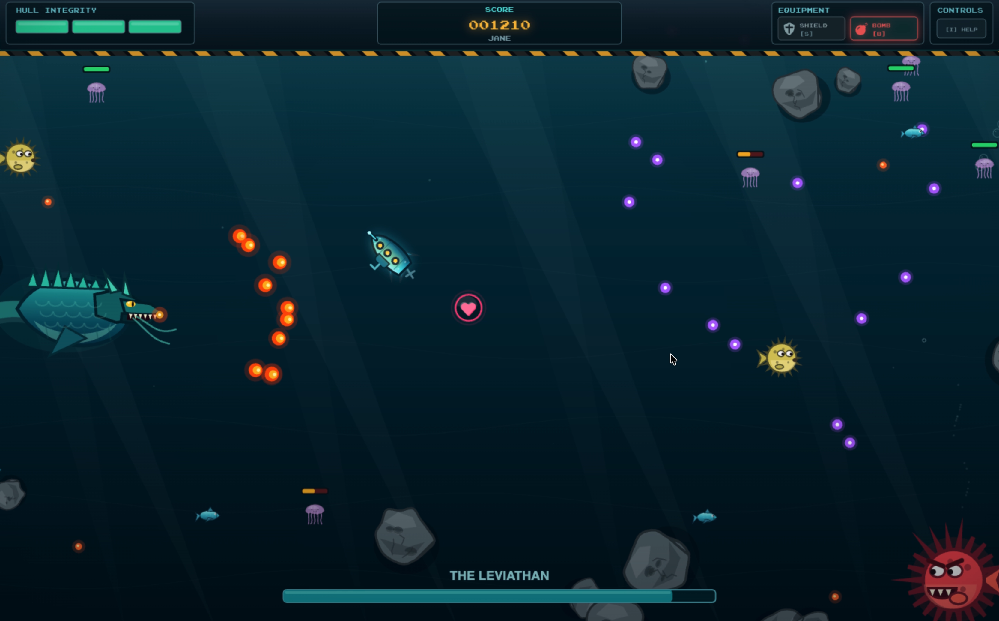

# Leviathan's Lair

  
  
  
  

  A deep-sea arcade survival game where you must survive long enough to face the Leviathan.

## Play the Game

  

> **Desktop only:** Leviathan's Lair uses keyboard controls and is best played on a desktop or laptop.

## Gameplay Preview

https://github.com/user-attachments/assets/7b7c919c-2f31-4353-8897-918b6d95ac3b

## Description

Leviathan's Lair is an underwater asteroids like game where you pilot a submarine and face off against deep-sea creatures, including a showdown with the legendary Leviathan. Navigate your way through treacherous waters, shooting at boulders to gain valuable pickups like shields, bombs and hearts, and strive to survive while aiming to get a high score.

## Features

- Three difficulty modes: Easy, Normal, and Hardcore
- Multiple enemy types, including jellyfish, piranhas, pufferfish, and sharks
- A Leviathan boss encounter
- Hearts, shields, bombs, and diamond pickups
- Combat includes projectiles and radial bombs
- Online high-score boards for each difficulty

## Game Controls

| Key | Action |
| --- | --- |
| <kbd>↑</kbd> / <kbd>↓</kbd> | Move forward / reverse |
| <kbd>←</kbd> / <kbd>→</kbd> | Rotate the submarine |
| <kbd>Space</kbd> | Fire a projectile |
| <kbd>B</kbd> | Deploy a bomb |
| <kbd>S</kbd> | Activate the shield |
| <kbd>P</kbd> | Pause the game |
| <kbd>I</kbd> | View the controls |
| <kbd>Q</kbd> | End the game |

## Built With

- **JavaScript** for the game logic and browser interactions
- **p5.js** for rendering, animation, and user input
- **Supabase** for shared high scores
- **Vercel** for deployment

## Game Inspiration

Leviathan's Lair draws inspiration from the following games:

- **Asteroids** — The game mechanics are similar, but with enhanced features like free movement for the submarine, pickups, and various enemy types.
- **Super Mario Bros.** — The idea for pickups comes from the mechanic of hitting blocks to reveal items.
- **Crash Bandicoot** — The variety of enemy types is inspired by the underwater levels in Crash Bandicoot.
- **Subnautica** — The game's theme and the concept of jellyfish shooting electricity were inspired by Subnautica and its Crabsquid creature.
